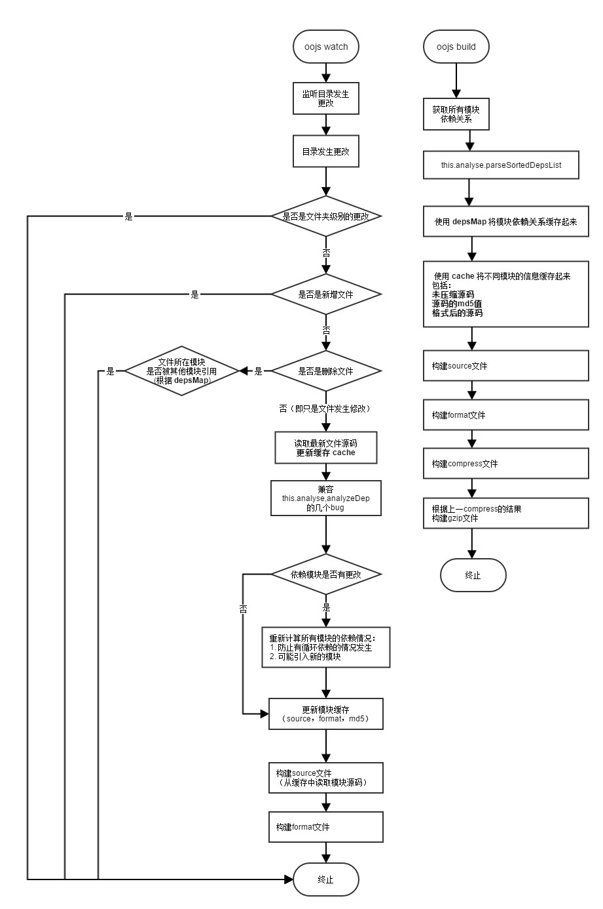

oojs-utility
============
oojs 工具库.

具体文档参见:
./doc/index.html

# 2015.9.24 更新：新增painter打包功能

如果需要打包painter,在package.json文件中build下新增打包任务，任务名称务必带有`painter`（大小写均可），或者任务中存在`type`属性，并且`type`值为`painter` 如：

```
"build": {
    "main": {
        "template": "./entry/ssp.js",
        "sourceFile": ["./test/ssp.source.js"],
        "formatFile": ["./test/ssp.js"],
        "compressFile": ["./asset/ssp.js"],
        "gzipFile": ["./asset/ssp.js.gz"]
    },
    "slidePainter": {
        "type": "painter",
        "template": "./src/dup/ui/painter/slide.js",
        "sourceFile": ["./test/painter/slide.source.js"],
        "formatFile": ["./test/painter/slide.js"],
        "compressFile": ["./asset/painter/slide.js"],
        "gzipFile": ["./asset/painter/slide.js.gz"]        
    },
    "inlayFixPainter": {
        "template": "./src/dup/ui/painter/inlayFix.js",
        "sourceFile": ["./test/painter/inlayFix.source.js"],
        "formatFile": ["./test/painter/inlayFix.js"],
        "compressFile": ["./asset/painter/inlayFix.js"],
        "gzipFile": ["./asset/painter/inlayFix.js.gz"]            
    },
    "floatPainter": {
        "template": "./src/dup/ui/painter/float.js",
        "sourceFile": ["./test/painter/float.source.js"],
        "formatFile": ["./test/painter/float.js"],
        "compressFile": ["./asset/painter/float.js"],
        "gzipFile": ["./asset/painter/float.js.gz"]            
    }
}
```
运行`oojs build`即可。也可以使用`oojs watch`对文件修改进行监视，也可自动打包painter


# 2015.9.8 更新:新增`oojs watch`

## 原oojs-build工具存在的问题：

1. 打包时间过慢，平均需要5s左右
2. 每次打包需要手动在命令行内运行`oojs build`
3. 因为上一个原因，所以开发调试时只能在合并后的大文件上调试开发，上线前再粘贴覆盖独立文件
4. 在打包时（`oojs build`）如果遇到打包脚本格式问题（如缺少逗号，缺少括号），打包会终止并且抛出异常，但无法准确告知出问题的文件和具体位置，难以排查

## 改进点：

1. 保留`oojs build`打包命令
2. 提供`oojs watch`命令，监听`entry`, `src`文件夹。如果该两个文件夹内文件发生变化（请留意下方**注意1**），自动进行打包，耗时80ms左右（请留意下方**注意2**）。
3. 如果在打包过程中遇到脚本格式问题而出错，能够及时终止程序，并且告知出现问题的脚本文件路径，行数，列数。
4. 添加打包过程中的命令行提示

## 注意

1. `oojs watch`只对**单个文件**的更改进行监听，对文件夹的新增和删除不做出任何响应。如果文件删除后通过回收站还原，则该还原操作视为**修改文件**而非**新增文件**。且有可能出错，请避免该操作
2. `oojs watch`发现文件更改而进行的打包，不包括对文件的压缩（即如`asset/ssp.js`文件）和gzip打包。因为uglify对文件压缩需要1s左右时间，比较耗时，且考虑到`oojs watch`使用场景为调试环境，所以摒弃该两项打包操作。如果需要对文件进行压缩和gzip打包，请运行`oojs build`命令

## 改进方案

新增`chokidar`node模块对文件更改进行监视。

第一次构建时将所有模块的源码缓存，以及这个模块所有依赖模块的名称缓存。一旦某个文件发生修改时，只重新读取该文件源码，并判断依赖是否有更改。如果依赖模块有更改，则重新计算所有文件依赖后开始重新构建；否则更新该模块后重新构建，其他模块的源码直接从缓存中读取。

具体流程图如下：

;